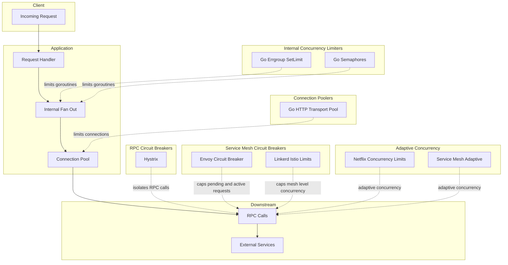

# Resilience Patterns

## The Canonical Invariant

> **Never allow unbounded concurrency or unbounded fan-out in any RPC,
> background job, or request handler — every parallelizable operation must
> have an explicit, enforced limit.**

This is the core invariant. Everything else in resilience engineering is a
secondary defense built on top of it. If you do not bound it, the system
*will* eventually find a way to push it to infinity.

Bound every source of concurrency, fan-out, and resource acquisition:

- Every goroutine pool / thread pool / task pool has a **hard cap**.
- Every connection pool has a **hard cap**.
- Every batch request has a **hard cap**.
- Every retry loop has a **hard cap**.
- Every queue has a **hard cap**.
- Every log emitter has a **hard cap** (or async + drop policy).

The generalized form:

> **No component may create work faster than the slowest downstream
> dependency can safely absorb it.**

And the operational law that compresses the entire field into one sentence:

> **Every system must be designed so that a single pathological request
> cannot multiply itself into a cluster-wide resource collapse.**

## The Amplification Cascade

Unbounded concurrency creates **resource amplification** — one missing
`SetLimit()` becomes a multi-layer failure mode. The April 2026 outage is the
canonical example:

```
20k goroutines
  → 20k memcached dials
  → 20k ephemeral ports
  → TIME_WAIT exhaustion
  → memcached failures
  → millions of error logs
  → blocking write(2)
  → 10× OS threads
  → GC pressure
  → OOM
  → restart
  → TIME_WAIT still full
  → instant re-failure
```

This is a textbook amplification cascade. A single missing
`errgroup.SetLimit(N)` created a multi-layer failure mode that no downstream
protection (Hystrix, circuit breakers) could stop, because the failure
originated *inside* the process, not at the RPC boundary.

### The cascade stages

| Stage | Trigger | Effect |
|-------|---------|--------|
| Fan-out | One request spawns 20k goroutines without a limit | 20k concurrent dials to memcached |
| Port exhaustion | 20k dials consume ephemeral ports | New dials fail; TIME_WAIT fills |
| Dependency failure | memcached calls fail | Each failure emits an error log |
| Log amplification | Millions of error logs | Synchronous logging blocks write(2) |
| Thread explosion | Blocking writes park goroutines | Runtime spawns 10× OS threads |
| GC pressure | Allocated objects from failed calls | GC pauses grow |
| OOM | Memory exceeds limit | Process killed |
| Restart loop | Supervisor restarts process | TIME_WAIT still full → instant re-failure |

The cascade is **self-reinforcing**: the restart does not clear TIME_WAIT, so
the process fails again immediately. The only fix is to bound the fan-out at
the source.

## The Meta-Rule

The canonical invariant is one instance of a single pattern that appears
across all of software engineering. Every one of these is the same rule:

- Avoiding N+1 queries (unbounded query fan-out).
- Avoiding unbounded recursion.
- Avoiding unbounded retries.
- Avoiding unbounded queues.
- Avoiding unbounded goroutines / threads / tasks.
- Avoiding unbounded log emission.
- Avoiding unbounded memory growth.

Each is "bound the thing that can grow without limit." If you internalize
one, you have internalized all of them.

## The Choke-Point Principle

All overload protections share one architectural requirement: **a single,
authoritative place where work enters or leaves the system so you can measure
it, limit it, and apply backpressure.**

You cannot:

- Limit concurrency if you do not know how many things are running.
- Limit connections if you do not know who is dialing.
- Break circuits if you do not know which calls are failing.
- Adapt concurrency if you do not know latency and success rates.

A **registry + metrics + a choke point** is the shared foundation. Every
resilience tool sits at such a choke point:

- Hystrix wraps every RPC call.
- Envoy sits in front of every service.
- Adaptive concurrency lives in the mesh.
- Internal concurrency limiters wrap every fan-out site.

Centralization of control is not optional. Scatter the calls and you lose the
ability to measure, limit, and break.

## The Four Classes

| Class | Scope | What it prevents | Cross-language? |
|-------|-------|------------------|-----------------|
| **Internal Concurrency Limiters (ICL)** | In-process fan-out | Thread/goroutine/task exhaustion from unbounded parallelism | No — language-specific |
| **Connection Poolers (CP)** | Outbound transport | Socket exhaustion, slow-dial cascades, TCP port depletion | No — stack-specific |
| **RPC Circuit Breakers (RPC-CB)** | Outbound calls to a dependency | Cascading failure when a downstream is degraded | No — language-specific |
| **Adaptive Concurrency (AC)** | Inbound or mesh-level | Overload under variable latency — sheds load before the queue fills | Yes — mesh-level |

### 1. Internal Concurrency Limiters (ICL)

Limit how many units of work run concurrently **inside one process**. This is
the innermost defense. Without it, a single request that fans out to 1000
sub-tasks can exhaust the runtime's scheduler, memory, or file descriptors.

### 2. Connection Poolers (CP)

Limit and reuse outbound connections. Without pooling, every call dials a new
socket — slow under load, and fatal at high fan-out because TCP ports exhaust
(~65k per source IP).

### 3. RPC Circuit Breakers (RPC-CB)

Stop calling a dependency that is failing. After a threshold of errors or
timeouts, the breaker opens; calls fail fast instead of waiting. After a cool
down, a probe call tests whether the dependency has recovered.

### 4. Adaptive Concurrency (AC)

Adjust the concurrency limit dynamically based on observed latency and success
rate. Unlike a static limit, AC tightens when latency rises (the system is
saturated) and loosens when latency falls (headroom available). This is the
only class that responds to the system's live state rather than a configured
constant.

## Hystrix: Necessary but Not Sufficient

Hystrix enforces concurrency limits per command (thread pools or semaphores),
timeouts, circuit breakers, fallbacks, and bulkheads. It is fundamentally a
**downstream isolation + backpressure tool**. It protects the services you
call.

Hystrix does **not** protect you from:

- Unbounded goroutines / threads inside a single request.
- Unbounded parallelism inside a handler.
- Unbounded connection creation.
- Unbounded log throughput.
- Unbounded memory growth.
- Unbounded batch sizes.

Hystrix caps concurrency **at the RPC boundary**, not inside your own code.
The April 2026 outage was caused by **internal unbounded concurrency**, not
downstream slowness. Hystrix would have caught the symptoms (memcached
latency) but not the cause (20k goroutines dialing memcached simultaneously).

| Rule | Who enforces it |
|------|-----------------|
| "No downstream dependency may consume more than N concurrent calls." | Hystrix (RPC-CB) |
| "No internal operation may create unbounded concurrency or unbounded resource acquisition." | ICL — your code, your responsibility |

The correct pattern is to **bound concurrency at every layer**: inside your
code (ICL), at the RPC boundary (RPC-CB), and at the system boundary (mesh).
Hystrix covers the RPC boundary. You still need internal concurrency limits,
connection pool limits, log throughput limits, memory caps, and queue caps.

> Netflix archived Hystrix. For new Java work, use Resilience4j. For
> adaptive concurrency that approaches what Hystrix was reaching for, use
> Netflix Concurrency Limits (NCL) or Envoy adaptive concurrency.

## Tool-Class Feature Matrix

Which tool class prevents which failure mode? The April 2026 outage required
**ICL** — only that class directly prevents the root cause (unbounded
internal fan-out). Everything else protects downstream, not your own code.

| Tool / System | Class | Prevents Unbounded Fan-Out? | Prevents Unbounded Connections? | Prevents Downstream Overload? | Adaptive? |
|---------------|-------|------------------------------|----------------------------------|-------------------------------|-----------|
| Hystrix | RPC-CB | No | No | Yes (thread/semaphore isolation) | No |
| Envoy Circuit Breakers | SM-CB | No | Yes (max connections, max pending, max requests) | Yes | Partially (outlier detection) |
| Netflix Concurrency Limits (NCL) | AC | Partially (per endpoint) | No | Yes (adaptive concurrency) | Yes |
| Go `errgroup.SetLimit` / semaphores | ICL | **Yes** | No | Only indirectly | No |
| Go `net/http` Transport + conn pool | CP | No | Yes | Indirectly | No |
| Service Mesh adaptive concurrency (Linkerd/Istio) | AC + SM-CB | No | Partially | Yes | Yes |
| Retry Budgeting (Envoy/Finagle) | SM-CB | No | No | Yes | Partially |

**Legend**: ICL = Internal Concurrency Limiters; CP = Connection Poolers;
RPC-CB = RPC Circuit Breakers; AC = Adaptive Concurrency; SM-CB = Service
Mesh Circuit Breakers.

**Only ICL directly prevents the root cause of an internal fan-out cascade.**
All other classes protect downstream or the network boundary.

## Request Lifecycle Diagram

Where each tool class applies in the request lifecycle, and what it limits:



The cascade in the April 2026 outage started at **Internal Fan Out** (node C)
because no ICL was attached. Every tool class downstream of C (CP, RPC-CB,
SM-CB, AC) could not see or stop the goroutine storm — they only observe
network-level behavior.

## No Universal Library

No single library handles all four classes across all languages. This is not a
gap in the ecosystem — it is structural:

- **Concurrency models differ.** Go has goroutines and channels. Java has
  thread pools and virtual threads. Rust has async executors and ownership
  rules. Node has an event loop and promises. Python has the GIL and asyncio.
  .NET has async/await and a thread pool. A universal concurrency limiter
  cannot exist across these models.
- **Networking stacks differ.** Go has built-in connection pooling. Node has
  none built in. Python's `requests` pools, but `asyncio` does not. Rust's
  `hyper`/`tokio` stack is fully manual. Java has Netty, HttpClient, OkHttp.
  A universal connection-pool limiter cannot exist across these stacks.
- **Failure semantics differ.** Exceptions, errors, panics, `Result<T, E>`.
  Sync, async, green threads. A universal circuit breaker cannot exist across
  these semantics.

## The Stack (What You Actually Need)

Cover all four classes with a **stack**, not a single library:

### Cross-language layer: Service Mesh

A service mesh (Envoy, Istio, Linkerd) is the closest thing to a universal
solution because it sits **outside** your code. It handles:

- Connection limits.
- Pending request limits.
- Retry budgets.
- Circuit breaking.
- Adaptive concurrency.
- Outlier detection.
- Timeouts.
- mTLS.
- Metrics.

It works for any language that speaks HTTP or TCP. **But it cannot handle
internal fan-out inside your code.** Only your language runtime can do that.

### Per-language layer: Internal libraries

| Language | ICL | Connection Pool | Circuit Breaker | Notes |
|----------|-----|-----------------|-----------------|-------|
| **Go** | `errgroup.SetLimit`, `golang.org/x/sync/semaphore` | `http.Transport` (built-in) | `gobreaker` (sony/gobreaker) | Transport pool is built in; tune `MaxIdleConnsPerHost` |
| **Java** | Resilience4j `Bulkhead` | OkHttp / Netty pools | Resilience4j `CircuitBreaker` | Resilience4j supersedes Hystrix (Netflix archived Hystrix) |
| **Rust** | `tokio::sync::Semaphore` | `hyper` client pool | `tower` middleware (`tower::limit`, `tower::retry`) | Tower composes all four as middleware layers |
| **Node** | `p-limit`, `bottleneck` | `agentkeepalive` | `opossum` (circuit breaker) | No built-in connection pooling; `agentkeepalive` is mandatory for HTTP |
| **Python** | `asyncio.Semaphore` | `aiohttp.TCPConnector` | `pybreaker` | `requests` pools by default; `asyncio` does not |
| **.NET** | `Channel<T>` + `SemaphoreSlim` | `HttpClientFactory` | `Polly` | `HttpClientFactory` manages pool lifetime; Polly handles CB + retry |

### Observability layer: OpenTelemetry

Combine **OpenTelemetry metrics** (cross-language) with the per-language
libraries above. This gives a consistent observability layer across all
services, even though the control layer remains language-specific.

Expose the "large but rare" requests that cause amplification cascades:

- Per-client metrics.
- Per-request batch size histograms.
- Concurrency gauge per endpoint.
- Connection churn metrics.
- TIME_WAIT counts.

## Decision Checklist

1. **Is the call crossing a process or network boundary?** Yes → the service
   mesh handles connection limits, circuit breaking, and adaptive concurrency
   at the choke point. No → you need an in-process ICL.
2. **Does the code fan out internally?** (One request triggers N sub-calls.)
   Yes → wrap the fan-out site in an ICL. The mesh cannot see internal
   parallelism. This is the single most important check — it is the one the
   April 2026 outage failed.
3. **Is the dependency unreliable or slow under load?** Yes → add an RPC
   circuit breaker in code, and let the mesh handle outlier detection at the
   network level.
4. **Does load vary unpredictably?** Yes → enable adaptive concurrency in the
   mesh. Static limits under-provision at peak and over-provision at trough.
5. **Are you in a polyglot environment?** Yes → the service mesh is your
   cross-language control plane; accept that internal fan-out control stays
   per-language.
6. **Is there no service mesh?** Then every service must implement its own
   connection limits, circuit breakers, and timeouts in code. This is
   duplicative and error-prone — the strongest argument for adopting a mesh.
7. **Does the handler emit logs on every failure?** Yes → bound log
   throughput (async logger with a bounded buffer and drop policy). The
   April 2026 cascade turned log emission into a blocking write that
   multiplied OS threads.

## Anti-Patterns

- **Unbounded fan-out.** A handler that spawns one goroutine per item without
  `errgroup.SetLimit` or a semaphore. This is the root cause of the April
  2026 outage. One pathological request → 20k goroutines → cluster collapse.
- **No choke point.** Calls scattered across the codebase with no central
  wrapper. You cannot measure, limit, or break what you cannot see.
- **Static concurrency limit only.** A fixed limit of 100 is wrong at both low
  load (over-provisioned) and high load (under-provisioned). Pair static limits
  with adaptive concurrency.
- **Circuit breaker without a retry budget.** A breaker that opens on 5 errors
  but allows unlimited retries on every call will retry-storm the downstream
  the moment it recovers. Use retry budgets (max retries per second) alongside
  breakers.
- **Connection pool sized for average load.** Pools must be sized for peak
  burst, not average. A pool of 10 on a service that bursts to 100 concurrent
  calls will queue 90 of them.
- **Relying on the mesh for internal fan-out.** The mesh sees network calls,
  not goroutines or async tasks. Internal fan-out without an ICL can exhaust
  the runtime even when the mesh reports green.
- **Relying on Hystrix for internal fan-out.** Hystrix caps concurrency at the
  RPC boundary, not inside your handler. It is necessary but not sufficient —
  pair it with an ICL.
- **Unbounded log emission on the failure path.** Synchronous logging that
  blocks when the downstream is failing multiplies the failure: every failed
  call emits a log, the log write blocks, the runtime spawns threads to park
  the blocked goroutines, GC pressure rises, OOM follows. Use async logging
  with a bounded buffer and a drop-on-overflow policy.

## See Also

- [Load Balancing and Reverse Proxy](load-balancing-and-proxy.md) — the
  service mesh handles east-west load balancing alongside circuit breaking.
- [Application Layer and Microservices](application-layer-microservices.md) —
  service mesh deployment and when to adopt one.
- [Asynchronism and Queues](asynchronism-and-queues.md) — back pressure is the
  queue-level analog of adaptive concurrency.
- [CAP, Consistency, and Availability](cap-consistency-availability.md) —
  availability patterns (fail-over, replication) complement resilience
  patterns (circuit breaking, shedding).
- [Cost-Aware System Design](cost-aware-system-design.md) — cap-and-shed is the
  cost analog of adaptive concurrency; fan-out cost amplification is the
  economic mirror of the amplification cascade.
- [System Security Basics](system-security-basics.md) — mTLS and observability
  (OpenTelemetry) are shared concerns with the service mesh.
- [Tech Decision Risk Assessment](tech-decision-risk-assessment.md) — the risk
  hierarchy for evaluating whether to adopt a service mesh (level 6: running a
  3rd-party service) vs. per-language libraries (level 11-12: new 3rd-party
  package).
- [Root-Cause First](root-cause-first.md) — the amplification cascade is the
  canonical example of why workarounds are unacceptable: the only durable fix
  is to bound the fan-out at the source.

## Sources

- [The System Design Primer](https://github.com/donnemartin/system-design-primer)
  — load balancing, back pressure, fail-over.
- [Envoy Adaptive Concurrency](https://www.envoyproxy.io/docs/envoy/latest/intro/arch_overview/concurrency/adaptive_concurrency)
  — mesh-level adaptive concurrency filter.
- [Resilience4j](https://resilience4j.readme.io/) — Java resilience primitives
  (circuit breaker, bulkhead, rate limiter, retry).
- [Netflix Hystrix](https://github.com/Netflix/Hystrix/wiki) — the original
  circuit breaker library (archived; use Resilience4j for new work).
- [Netflix Concurrency Limits](https://github.com/Netflix/concurrency-limits)
  — adaptive concurrency control; the closest library to what Hystrix was
  reaching for.
- April 2026 outage post-mortem — unbounded goroutine fan-out to memcached
  causing ephemeral port exhaustion, log amplification, GC collapse, OOM, and
  restart loop. The canonical example of why the canonical invariant exists.
